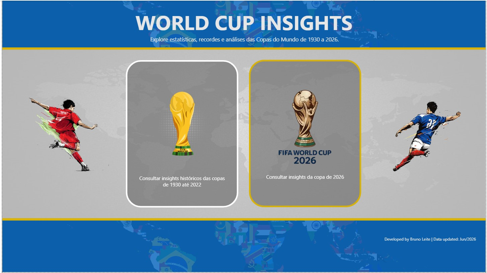
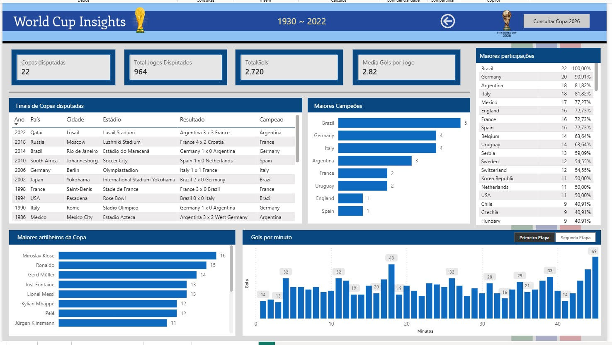
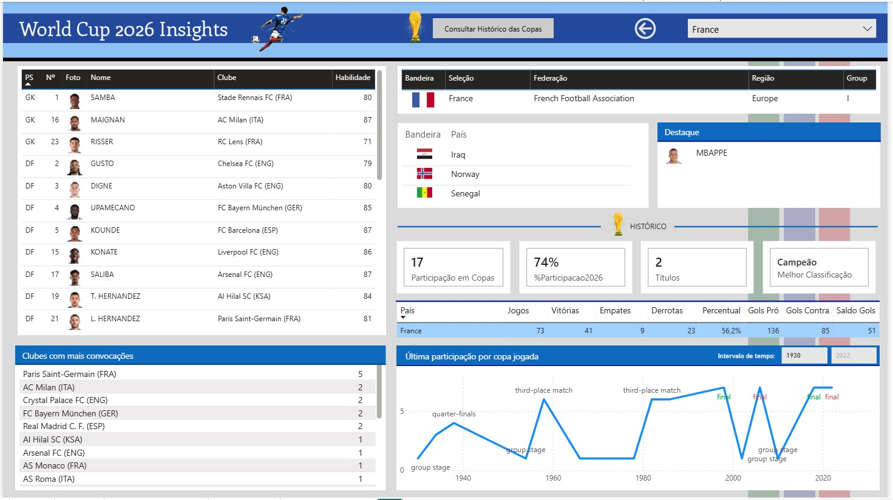
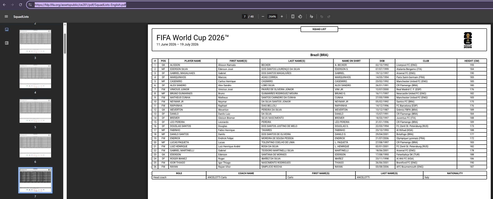
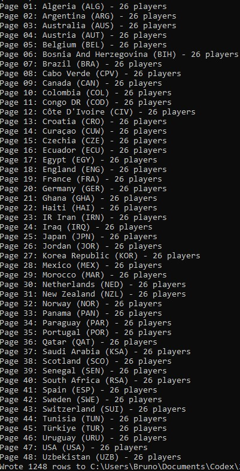
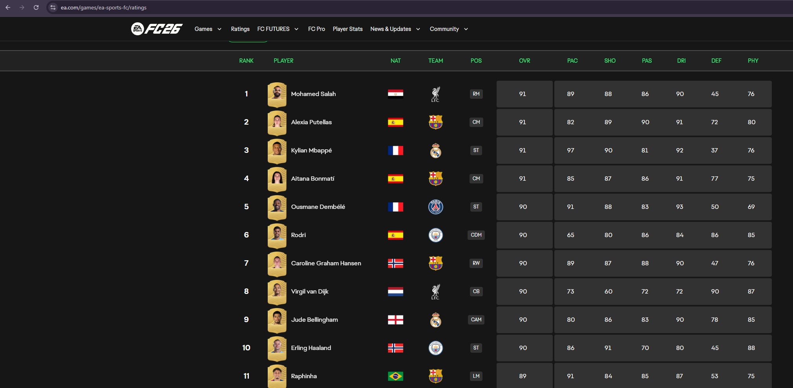
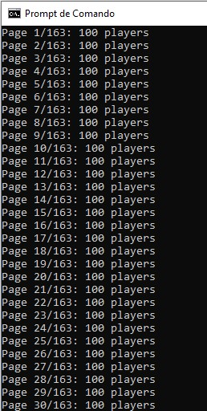
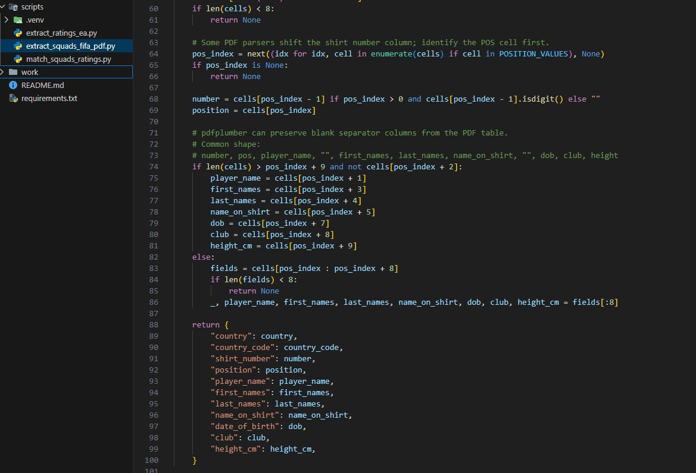

# World Cup Insights

Dashboard desenvolvido em Power BI com foco na análise histórica das Copas do Mundo FIFA (1930–2022) e exploração dos dados da Copa do Mundo 2026.
Fonte oficial da FIFA, rating da EA e tratamento automatizado em Python.

## Sobre o Projeto

O objetivo deste projeto é fornecer uma experiência interativa para explorar estatísticas, recordes e curiosidades das Copas do Mundo, permitindo ao usuário navegar entre informações históricas e dados da edição de 2026.

### Histórico das Copas (1930–2022)

* Número de Copas disputadas
* Total de jogos realizados
* Total de gols marcados
* Média de gols por partida
* Finais de todas as edições
* Ranking de seleções campeãs
* Seleções com mais participações
* Maiores artilheiros da história
* Distribuição de gols por minuto

### Copa do Mundo 2026

* Informações das seleções classificadas
* Elencos completos
* Clubes com mais convocados
* Histórico de participações
* Melhor campanha da seleção
* Estatísticas históricas por país
* Evolução da seleção ao longo das Copas

## Tecnologias Utilizadas

* IA Codex
* Python
* CMD
* Power BI Desktop
* Power Query (M)
* DAX
* Bookmarks para navegação

## Fontes de Dados

* FIFA World Cup Historical Data
* Dados públicos de seleções e jogadores
* Bases complementares para bandeiras e informações geográficas

https://www.kaggle.com/datasets/joshfjelstul/world-cup-database?
https://datahub.io/football/worldcup
https://fdp.fifa.org/assetspublic/ce281/pdf/SquadLists-English.pdf
https://www.ea.com/games/ea-sports-fc/ratings

## Destaques do Projeto

* Interface personalizada inspirada na identidade visual da Copa do Mundo
* Página inicial interativa para navegação entre módulos
* Experiência orientada por storytelling
* Layout responsivo para publicação no Power BI Service

## Screenshots

### Página Inicial

### Histórico das Copas

### Copa do Mundo 2026

### Extração arquivos teams

### Extração ratting players

### Python Code

## Autor

Bruno Leite

LinkedIn: https://www.linkedin.com/in/bruno-leite-342b26160/

---

Projeto desenvolvido para fins de estudo, análise de dados e inclusão em portfolio.
